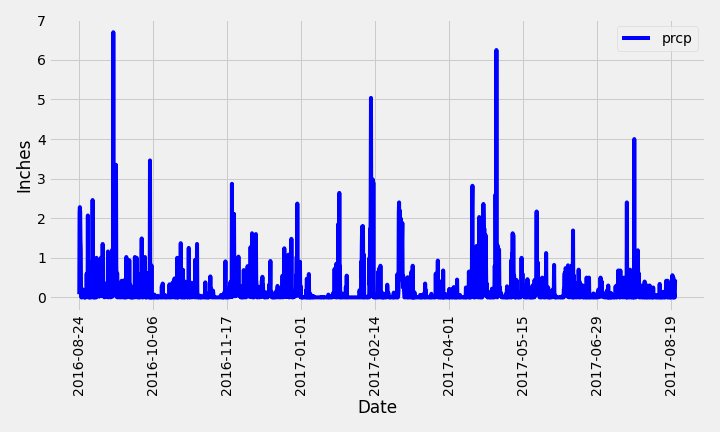
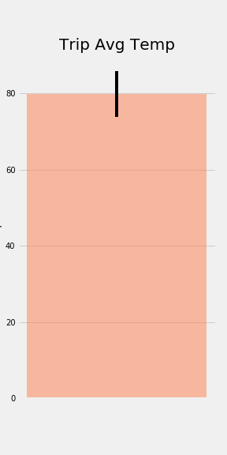
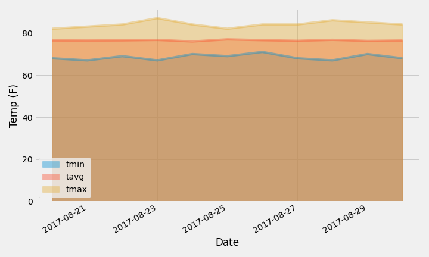
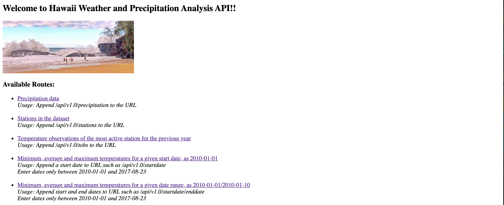

# Surfs Up!

An application to assist in vacation trip planning in Hawaii with climate analysis using Python (Pandas, Matplotlib), SQLAlchemy (ORM Queries) and Flask.

## Step 1 - Climate Analysis and Exploration

A start date and end date are chosen (approximately 10 days in total) for the trip.

SQLAlchemy is used to connect to the sqlite database and reflect the tables into classes and  a reference to those classes called Station and Measurement is saved.

### Precipitation Analysis

A query is designed to retrieve the last 12 months of precipitation data and the results are plotted with 
Pandas.

### Station Analysis

* Designed a query to calculate the total number of stations.

* Designed a query to find the most active stations.

* Design a query to retrieve the last 12 months of temperature observation data (TOBS).

### Temperature Analysis I

* Average temp for June : 74.94411764705882

* Average temp for December : 71.04152933421226

* Unpaired (independent) t-test score : -31.60372399000329 , pvalue=3.9025129038616655e-191

### Temperature Analysis II

The minimum, average and maximum temperatures for the trip are calculated using the previous years temperature data for those same dates. A bar chart is plotted with the average temperature for the y value and the peak-to-peak (tmax-tmin) value as the y error bar (yerr).

### Daily Rainfall Average

* Calculate the rainfall per weather station using the previous year's matching dates.

* Calculate the daily normals (the min, avg, and max temperatures).

- - -

## Step 2 - Climate App

A Flask API is designed based on the queries developed as part of the initial analysis above and the following routes are created.

### Routes
  * <b> / </b>  
    * Home page that lists all the routes that are available

  * <b> /api/v1.0/precipitation </b> 
    * Returns a JSON list of all the dates and the corresponding precipitation values

  * <b> /api/v1.0/stations </b> 
    * Returns a JSON list of stations from the dataset
    
  * <b> /api/v1.0/tobs </b> 
    * Returns a JSON list of temperature observations (TOBS) for the previous year for the most active station

  * <b> /api/v1.0/<start> </b> 
    * Returns a JSON list of the minimum, average and the maximum temperatures for all dates greater than and equal to the start date

  * <b> /api/v1.0/<start>/<end> </b> 
    * Returns a JSON list of the minimum, average and the maximum temperatures for a given date range.

